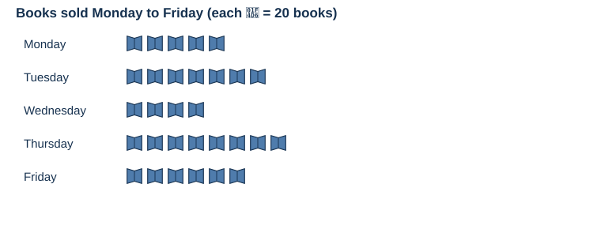
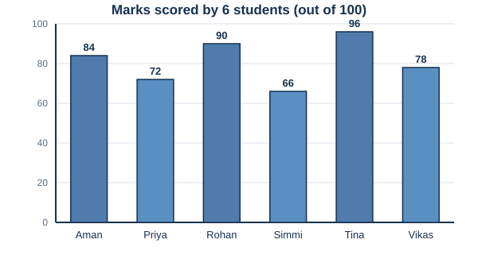

# Week 8 — Data Handling

Tally marks, pictographs, and bar graphs. 15 questions, 4-option MCQ, untimed.

---

**Q1.** In tally marks, two complete groups (each of 5 strokes) plus 3 extra strokes represent which number?
A) 10  B) 11  C) 12  D) 13

The pictograph below shows the number of books sold by a shop over five days:

**Q2.** On which day were the fewest books sold?
A) Monday  B) Tuesday  C) Wednesday  D) Thursday

**Q3.** What is the total number of books sold over the 5 days?
A) 650  B) 680  C) 700  D) 720

**Q4.** How many more books were sold on Thursday than on Wednesday?
A) 80  B) 85  C) 90  D) 95

**Q5.** What is the average (mean) number of books sold per day?
A) 130  B) 135  C) 140  D) 145

The bar graph below shows marks (out of 100) scored by 6 students:

**Q6.** Who scored the highest marks?
A) Aman  B) Rohan  C) Tina  D) Vikas

**Q7.** What is the range of marks (highest − lowest)?
A) 26  B) 28  C) 30  D) 32

**Q8.** How many students scored above 80?
A) 2  B) 3  C) 4  D) 5

**Q9.** What is the total marks scored by all 6 students?
A) 476  B) 486  C) 496  D) 506

**Q10.** What is the average marks of all 6 students?
A) 79  B) 80  C) 81  D) 82

**Q11.** A pictograph shows that each symbol represents 25 books. If a library shows 8 symbols for its Fiction section, how many fiction books are there?
A) 175  B) 200  C) 225  D) 250

**Q12.** In a survey of 200 people, 35% prefer tea and 45% prefer coffee. The rest prefer juice. How many people prefer juice?
A) 30  B) 35  C) 40  D) 45

The table below shows rainfall (in mm) over 4 months:

| Month | Rainfall (mm) |
|---|---|
| January | 45 |
| February | 60 |
| March | 38 |
| April | 77 |

**Q13.** In which month was the rainfall highest?
A) January  B) February  C) March  D) April

**Q14.** What is the total rainfall over the 4 months?
A) 210 mm  B) 220 mm  C) 230 mm  D) 240 mm

**Q15.** What is the difference between the highest rainfall and the average rainfall (rounded to the nearest whole number)?
A) 18  B) 20  C) 22  D) 24
