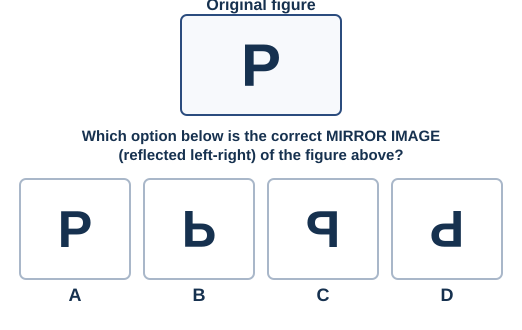
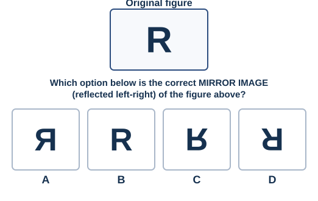
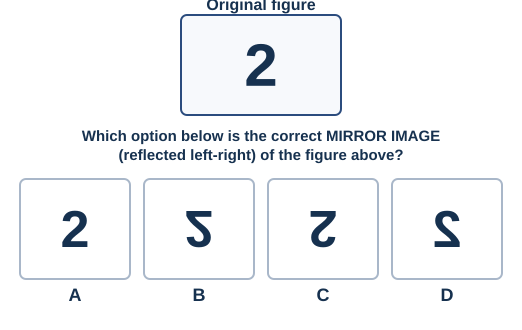
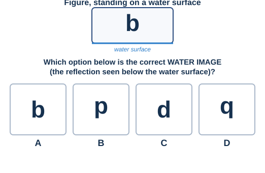
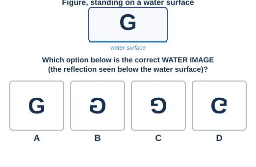
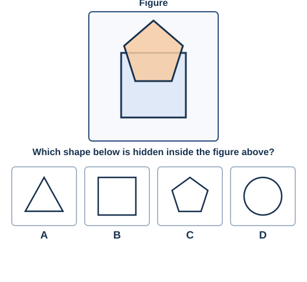
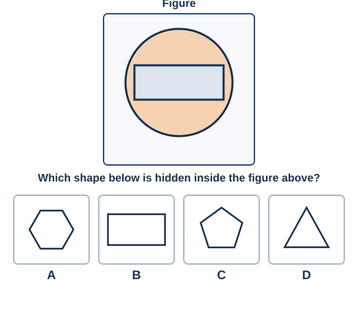
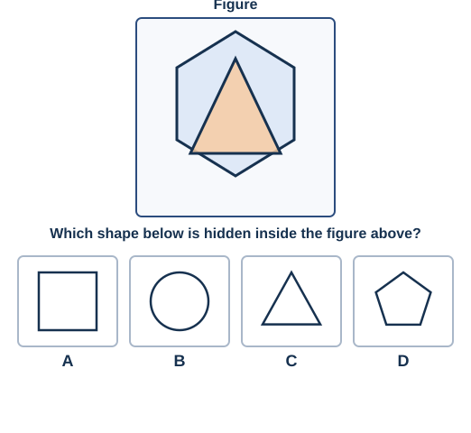

# Week 10 — Reasoning: Ranking, Direction, Mirror & Water Images, Embedded Figures, Clock & Calendar

18 questions, 4-option MCQ, untimed. Part A (Q1–10) is text-based
reasoning; Part B (Q11–18) is diagram-based, each with its own figure.

## Part A — Ranking, Direction Sense, Clock & Calendar

---

**Q1.** In a line of 30 students, Karan is 11th from the left. What is his position from the right?
A) 19th  B) 20th  C) 21st  D) 18th

**Q2.** Meera is ranked 15th from the top and 26th from the bottom in her class. How many students are in the class?
A) 39  B) 40  C) 41  D) 42

**Q3.** Five boxes are stacked: the red box is above the green box. The blue box is below the green box. The yellow box is at the very top, above the red box. The black box is at the very bottom, below the blue box. Which box is in the middle?
A) Red  B) Green  C) Blue  D) Yellow

**Q4.** Facing South, Priya turns 90° anticlockwise. Which direction is she facing now?
A) East  B) West  C) North  D) South

**Q5.** A man walks 8 km East, then 6 km East again, then 5 km West. How far, and in which direction, is he from his starting point now?
A) 9 km East  B) 19 km East  C) 9 km West  D) 14 km East

**Q6.** If East becomes South, and South becomes West (following a fixed rule), what does North become?
A) East  B) West  C) South  D) North

**Q7.** If today is Thursday, what day was it 23 days ago?
A) Monday  B) Tuesday  C) Wednesday  D) Sunday

**Q8.** If 1st October is a Tuesday, what day is 25th October?
A) Thursday  B) Friday  C) Saturday  D) Wednesday

**Q9.** A clock shows 7:45. What time will it show after 50 minutes?
A) 8:25  B) 8:30  C) 8:35  D) 8:45

**Q10.** In a quiz competition, Team A scored more than Team B. Team C scored less than Team B but more than Team D. Team E scored the highest of all. Which team scored the lowest?
A) Team A  B) Team B  C) Team D  D) Team E

## Part B — Mirror Images, Water Images & Embedded Figures

### Mirror Images

**Q11.**

**Q12.**

**Q13.**

### Water Images

A **water image** is the reflection you'd see if the figure were standing
on a water surface and you looked at its reflection below — a true
upside-down (top-to-bottom) flip, not a left-right one.

**Q14.**

**Q15.**

### Embedded Figures

**Q16.**

**Q17.**

**Q18.**

